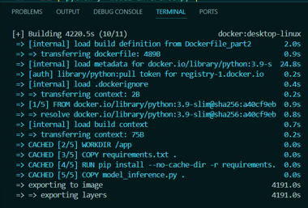
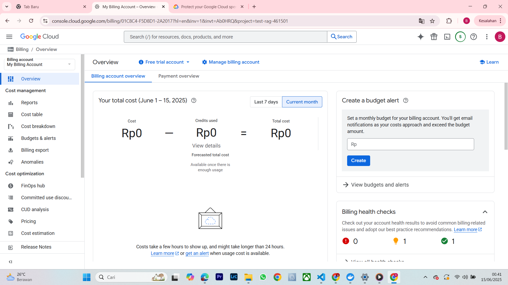
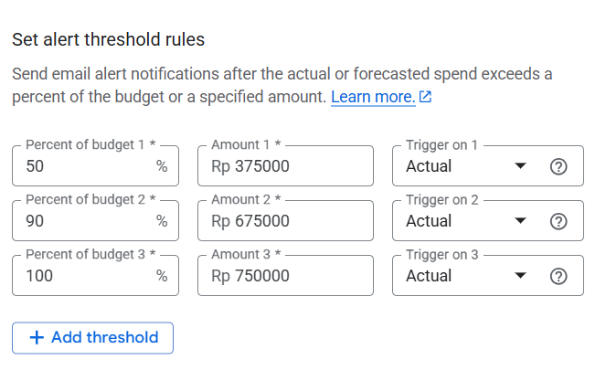
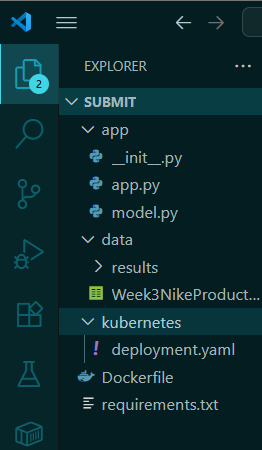
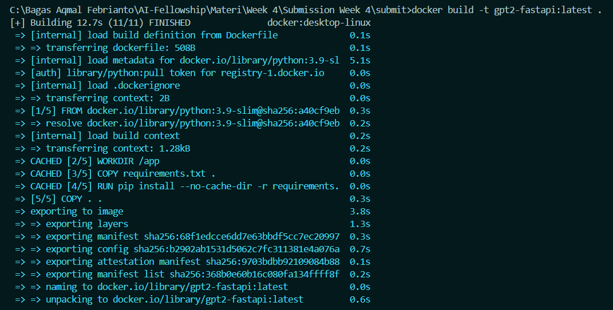
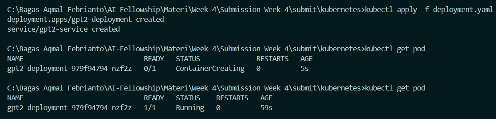
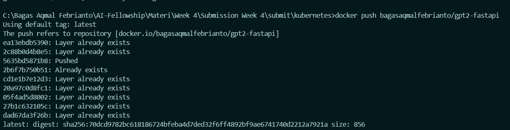
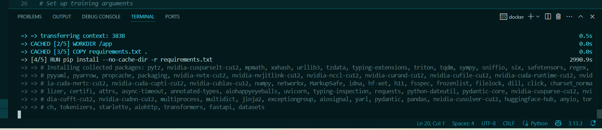

# Deploy Generative AI Menggunakan CI/CD

Repositori ini merupakan **Tugas Week 4 AI Engineer Fellowship by IYKRA** yang berisi langkah-langkah dan dokumentasi untuk mendepoy **model Generative AI** menggunakan pipeline **CI/CD otomatis**. Pipeline ini mencakup tahap build, push, dan deploy ke **Google Kubernetes Engine (GKE)** menggunakan **Cloud Build**, serta memastikan model dapat diakses melalui URL.

Tugas ini dikerjakan oleh: **Bagas Aqmal Febrianto**

---

## TASK

1. Create a budget alert in your GCP Billing account and provide a screenshot as proof.

2. Build an automated CI/CD pipeline covering build, push, and deploy stages using Cloud Build and Google Kubernetes Engine (use type: load balancing). Ensure your Generative AI model is successfully deployed by providing an accessible endpoint
URL from a browser.

3. Document all tasks and steps in your GitHub repository, including brief explanations.
(Ensure the final commit in your repository for this assignment is made before
the deadline)


---

## Pengerjaan Soal

**Note :**
Keterbatasan Waktu dan Resource:  Pengerjaan Task 2 belum dapat diselesaikan sepenuhnya karena keterbatasan waktu dan sumber daya. Setiap pembuatan docker image untuk model image generatif memerlukan waktu sekitar 1-2 jam untuk diproses, yang mengharuskan penyelesaian secara bertahap.  Dengan demikian, Task 2 tidak akan dilanjutkan hingga semua langkah sebelumnya selesai. Namun perihal dengan Hands-on saya sudah mengikuti dan mempraktikan semua hands-on, walaupun membutuhkan waktu yang lumayan. 

Sebagai contoh :



### Soal 1: Membuat Budget Alert di GCP

1. Buka [Google Cloud Billing Console](https://console.cloud.google.com/billing).
2. Buatlah budget dan alert untuk memantau pengeluaran di akun GCP Anda. Klik Billing -> Budget and Alerts
3. Berikut adalah Hasil yang sudah saya buat : 

Gambar berikut pengeluaran awal saya (Dalam hal ini saya belum pernah menggunakan GCP dan melakukan set Alert)



Sebagai bentuk pengingat atau Alert, kita bisa melakukan konfigurasi dengan mengatur Threshold rules. Disini saya memanfaatkan fitur tersebut sebagai pemantau pengeluaran.



Berikut adalah gambar ketika Alert sudah diterapkan.


### Soal 2: Bangun pipeline CI/CD otomatis

Berikut adalah struktur file yang dibentuk : 



## 1. Inisiasi file Fastapi
Kode berikut adalah cara membuat API menggunakan FastAPI yang memanfaatkan model GPT-2 yang sudah di-fine-tune dengan TensorFlow.

```python
from fastapi import FastAPI
from transformers import TFGPT2LMHeadModel, GPT2Tokenizer

# Load tokenizer dan model GPT-2 yang sudah di-fine-tune menggunakan TensorFlow
tokenizer = GPT2Tokenizer.from_pretrained("gpt2")
model = TFGPT2LMHeadModel.from_pretrained("./data/results")  # Lokasi model hasil fine-tuning

# FastAPI instance
app = FastAPI()

@app.get("/")
async def generate_description(prompt: str):
    # Encode prompt dan generate output
    inputs = tokenizer.encode(prompt, return_tensors="tf")
    outputs = model.generate(inputs, max_length=100, num_return_sequences=1)
    description = tokenizer.decode(outputs[0], skip_special_tokens=True)
    return {"generated_description": description}
```

## 2. Fine-Tuning Model GPT-2 dengan Dataset Deskripsi Produk

Kode berikut menunjukkan adalah fine-tuning pada model GPT-2 menggunakan dataset deskripsi produk.

```python
import pandas as pd
from datasets import Dataset
from transformers import GPT2LMHeadModel, GPT2Tokenizer, TextDataset, DataCollatorForLanguageModeling, Trainer, TrainingArguments

# Load tokenizer dan model GPT-2
tokenizer = GPT2Tokenizer.from_pretrained("gpt2")
model = GPT2LMHeadModel.from_pretrained("gpt2")

# Menambahkan padding token
tokenizer.pad_token = tokenizer.eos_token

# Memuat dataset dan memprosesnya
df = pd.read_csv("../data/Week3NikeProductDescriptionsGenerator.csv")
descriptions = df['Product Description'].tolist()

# Tokenisasi deskripsi produk
def preprocess(desc):
    encodings = tokenizer(desc, truncation=True, padding=True, max_length=512)
    return Dataset.from_dict(encodings)

train_dataset = preprocess(descriptions)

# Menyiapkan collator untuk data training
data_collator = DataCollatorForLanguageModeling(tokenizer=tokenizer, mlm=False)

# Set up training arguments
training_args = TrainingArguments(
    output_dir="./data/results", 
    overwrite_output_dir=True,
    num_train_epochs=3,
    per_device_train_batch_size=4,
    save_steps=10_000,
    save_total_limit=2,
    prediction_loss_only=True
)

# Inisialisasi Trainer untuk fine-tuning
trainer = Trainer(
    model=model,
    args=training_args,
    data_collator=data_collator,
    train_dataset=train_dataset
)

# Fine-tuning model
trainer.train()
```

## 3. Kubernetes Deployment dan Service untuk FastAPI dengan GPT-2

Berikut adalah contoh konfigurasi Kubernetes untuk mendeply aplikasi FastAPI yang menggunakan model GPT-2. Konfigurasi ini meliputi `Deployment` dan `Service` untuk menjalankan aplikasi di Kubernetes.

```yaml
apiVersion: apps/v1
kind: Deployment
metadata:
  name: gpt2-deployment
spec:
  replicas: 1
  selector:
    matchLabels:
      app: gpt2
  template:
    metadata:
      labels:
        app: gpt2
    spec:
      containers:
        - name: gpt2-container
          image: bagasaqmalfebrianto/gpt2-fastapi:latest
          ports:
            - containerPort: 8000
          resources:
            requests:
              cpu: "200m"
              memory: "300Mi"
            limits:
              cpu: "500m"
              memory: "400Mi"
---
apiVersion: v1
kind: Service
metadata:
  name: gpt2-service
spec:
  selector:
    app: gpt2
  ports:
    - protocol: TCP
      port: 80       # Port yang akan di-expose
      targetPort: 8000  # Port di container yang menjalankan FastAPI
```

## 4. Daftar Dependensi

Berikut adalah versi dependensi yang digunakan dalam proyek ini:

- **datasets**: `3.6.0`
- **transformers**: `4.52.4`
- **pandas**: `2.2.3`
- **fastapi**: `0.115.12`
- **uvicorn**: `0.34.3`
- **torch**: `2.7.1`

## 5. Dockerfile untuk FastAPI dengan Model GPT-2

Dockerfile ini digunakan untuk membuat image Docker yang menjalankan aplikasi FastAPI dengan model GPT-2.

```Dockerfile
# Gunakan image Python sebagai base image
FROM python:3.9-slim

# Set working directory di container
WORKDIR /code

# Salin requirements dan install dependencies
COPY ./requirements.txt /code/requirements.txt

RUN pip install --no-cache-dir -r /code/requirements.txt

# Salin seluruh kode aplikasi ke dalam container
COPY ./ /code/app

# Expose port FastAPI
EXPOSE 8000

# Jalankan aplikasi FastAPI menggunakan Uvicorn
CMD ["uvicorn", "app.app:app", "--host", "0.0.0.0", "--port", "8000"]
```

## 6. Membuat Docker Image
Membuat Docker image menggunakan konfigurasi ``docker build -t gpt2-fastapi:latest .``



## 7. Terapkan File Konfigurasi deployment.yaml

Setelah memastikan bahwa kubectl terhubung ke cluster yang tepat, jalankan perintah ``kubectl apply -f deployment.yaml
`` untuk menerapkan konfigurasi yang ada di dalam file deployment.yaml



Tampak bahwa pod berhasil dibuat.

## 8. Push Image ke Docker Hub

Melakukan push image menggunakan konfigurasi ``docker push bagasaqmalfebrianto/gpt2-fastapi:latest``



The end~

Saya harus mengulang kembali karena


